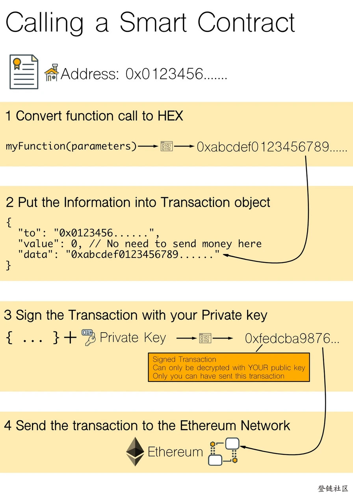

# 以太坊智能合约简介

“智能合约”这个名称有点误导。 它不是真正的合约、也不是特别智能，它们只是可以区块链上运行代码。

## 合约帐户

首先要了解的是**智能合约是以太坊网络上的一种特殊帐户**。 我们有用户帐户，还可以拥有智能合约帐户。

用户帐户有:

- 地址（有点像我们的银行帐号 - 比特币也有同样的概念）
- 余额（我有多少钱: 以太）

智能合约账户有：

- 地址
- 余额（有多少钱: 以太）
- 状态
- 代码

地址是帐户的唯一标识符，与常规用户帐户一样。

余额也与常规用户帐户相同。 不同的是，智能合约的余额意味着代码可以拥有资金，它可以管理资金。因此如果代码不正确，它可能会错误处理这笔资金。

智能合约帐户的状态是智能合约中声明的所有变量和变量的当前状态。 它的工作方式与大多数编程语言中的类中的变量变量相同。 实际上，最简单方法去理解智能合约可以类比为一个类实例化对象，唯一的区别是这个对象永远存在区块链网络中（除非程序进行自毁）。

智能合约的代码是编译后可以在以太坊客户端和节点可以运行的字节码。 它是在创建智能合约时执行的代码，它包含我们可以调用的函数。 就像面向对象编程语言中的对象一样。

智能合约更有趣地方：他们可以调用其他智能合约，这开启了创造一个自主代理的能力，这些代理可以自己进行交易。

## 交易层面

比特币交易非常简单，它只做一件事，就是进行交易。 忽略细节，这一切都归结为TO（谁收钱），FROM（谁汇款）和AMOUNT（多少钱）。 这让比特币网络中的参与者可以传递价值并存储价值。

以太坊很大的不同是其交易还有一个DATA字段。 DATA字段支持三种类型的交易：

价值传递 (和比特币相同)：

- TO ：收款地址
- DATA ：留空或留言信息（etherscan中显示为input data）
- FROM ：谁发出
- AMOUNT ：发送多少（etherscan中显示为value）

创建合约：

- TO ：留空 (这就是触发创建智能合约的原因)
- DATA ：包含编译为字节码的智能合约代码
- FROM ：谁创建
- AMOUNT ：可以是零或任何数量的以太，它是我们想要给合约的存款。

调用合约函数：

- TO： 目标合约账户地址
- DATA： 包含函数名称和参数 - 标识如何调用智能合约函数
- FROM ：谁调用
- AMOUNT ： 可以是零或任意数量的以太，例如可以支付合约服务费用。

虽然实际交易有更多复杂的细节，但核心概念就是这些。让我们看一些更具体的例子，说明这些交易长什么样。

```json
// 价值传递: 就是转移一定数量的以太到某个地址，如果我们愿意也可以向交易添加消息。
{
    to: '0x687422eEA2cB73B5d3e242bA5456b782919AFc85',
    value: 0.0005
    data: ‘0x’ // 也可以附加消息
}

// 创建智能合约：TO为空表示创建智能合约，DATA包含编译为字节码的智能合约代码。
{
    to: '',
    value: 0.0
    data: ‘0x6060604052341561000c57xlb60405160c0806……………’
}

// 调用合约方法: 函数调用信息放在DATA变量中，把这个交易信息发送到要调用的智能合约的地址
{
    to: '0x687422eEA2cB73B5d3e242bA5456b782919AFc85’, //合约
    value: 0.0
    data: ‘0x6060604052341561000c57fe5b60405160c0806……………’
}
```

## 执行层面

当智能合约部署到以太坊网络时，任何人都可以调用智能合约的功能（当然也可能存在某些安全原因阻止人们使用的功能，但不妨碍我们自由尝试）。

在智能合约上调用函数在很多方面和“正常”编程类似 - 当然在执行方面存在一些差异。

假设我们有一个“MyObject”类型的对象。 该对象有一个名为“myFunction”的函数。 要调用它，我们可以简单地引用对象的实例，调用哪个函数以及调用它的参数。 

像这样：myObjectReference.myFunction(parameters);
如果函数返回任何值，则可以把它保存在变量中：myVariable = myObject.myFunction(parameters);

从概念上讲，调用智能合约是一回事。 唯一的区别是我们必须将有关调用的信息放入交易中，对其进行签名并发送到以太坊网络中执行。

假设想用一些参数调用智能合约“0x0123456”上函数“myFunction”，大概包含以下四个步骤：


