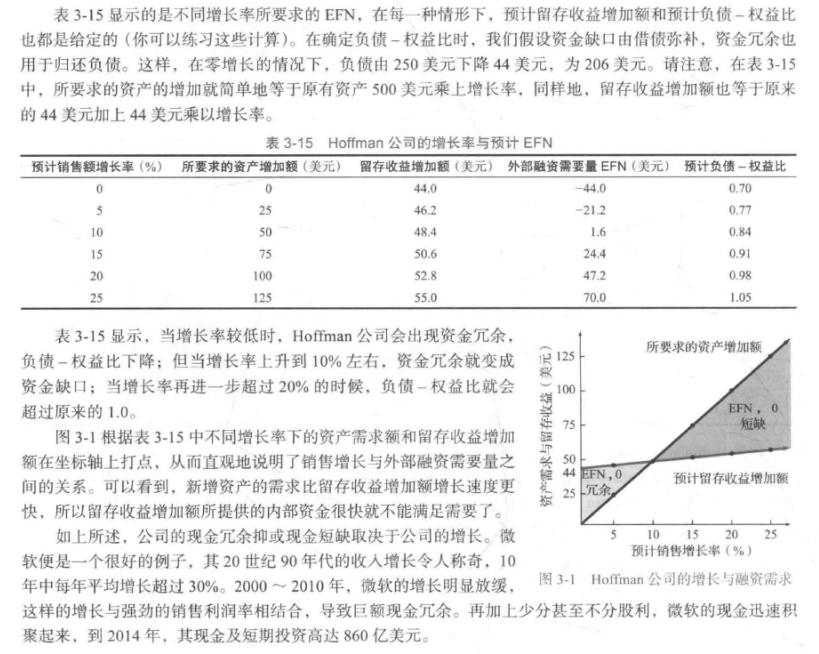
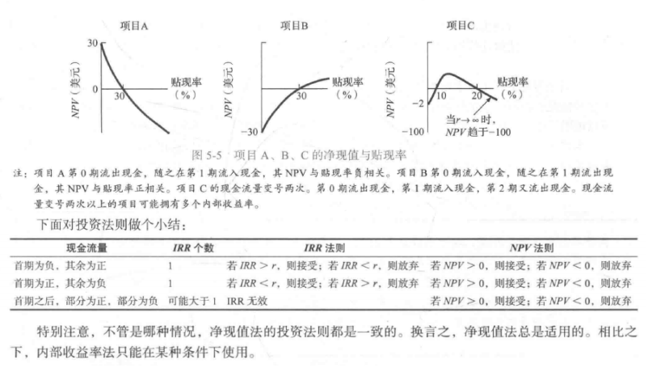

# 公司理财-罗斯

## 第3章-财务报表分析与长期计划

### 财务报表分析

报表的标准化： 共同比报表（common-size statement）,即以金额表达的数据转换为百分百的形式。

共同比资产负债表：报表中的每一项目数据都表示为占总资产的百分比形式。

共同比利润表：报表中的每一项目数据都表示为占销售额的百分比形式。

盈利的度量指标：

- 净利润：总销售收入-总成本费用
- 每股收益（EPS）：反映每股的净利润，净利润/股本
- 息税前利润（EBIT）：扣除利息和税之前的净利润，剔除了资本结构（利息费用）和税的差异
- 息税折旧摊销前利润（EBITDA）：扣除利息、税、摊销/折旧（非现金费用）之前的净利润，EBITDA = EBIT + 摊销/折旧

> 以上指标有时前面会加上LTM，表示最近12个月的数字，如LTM EPS 表示过去12个月的每股收益，有时也用TTM表示，LTM和TTM是一样的

### 比率分析

短期偿债能力/流动性指标（短期债权人所关心的）：

- 流动比率 = 流动资产/流动负债，通常至少应达到1，否则意味着净营运资本（流动资产 - 流动负债）为负，会受不同交易类型影响，如通过长期债务融资，则流动资产现金会增加，流动负债不变，流动比率上升，长期债务增加。
- 速动比率 = （流动资产 - 存货）/ 流动负债，存货通常是流动性最低的流动资产，存货过多可能是短期困境的标志，又称酸性试验。
- 现金比率 = 现金 / 流动负债

长期债务能力/杠杆比率（leverage ratio）：

- 总负债比率 = 总负债 / 总资产，如值为0.28，表示1元的总资产中有0.28是来自负债
- 负债权益比 = 总负债 / 总权益，（debt-equity ratio）
- 权益乘数 = 总资产 / 总权益，(equity multiplier) 还等于 1 + 负债权益比
- 利息倍数（TIE） = EBIT / 利息，也称利息保障率
- 现金对利息的保障倍数 = EBITDA / 利息

资产管理/资产利用/周转指标：

- 存货周转率 = 当年产品销售成本 / 年末存货，衡量公司产品销售速度有多快，如值为3.2次，则说明年末存货可以在当年被销售3.2次
- 存货周转天数 = 365 / 存货周转率，如值为114天，则说明114天可以将存货卖完1次
- 应收账款周转率 = 销售额 / 应收账款，衡量销售货款的回收速度有多快
- 应收账款周转天数 = 365 / 应收账款周转率，如值为30天，说明公司平均30天收回赊款，又称平均收账期（ACP）
- 应付账款周转率 = 销售成本 / 应付账款
- 应付账款周转天数 = 365 / 应付账款周转率，公司的潜在债权人应关注这个指标
- 总资产周转率 = 销售额 / 总资产，如值为0.6，说明1元资产产生了0.6元的收入

盈利性指标：

- 销售利润率（PM） = 净利润 / 销售额，如值为0.5，说明1元销售额中产生了0.5元的利润
- EBITDA利润率 = EBITDA / 销售额，EBITDA更接近经营现金流量
- 资产收益率（ROA） = 净利润 / 总资产，说明每1元资产带来的利润
- 权益收益率（ROE） = 净利润 / 总权益，说明每1元权益带来的利润，也称净资产收益率

市场价值的度量指标（仅对于上市公司）：

- 每股收益(EPS) = 净利润 / 股本，
- 市盈率（PE） = 每股价格 / 每股收益，
- 企业价值（EV） = 市值 + 附息债务市场价值 - 现金，说明购买该企业发行在外的所有股票并偿付债务需要的资金
- 企业价值乘数 = EV / EBITDA

### 杜邦恒等式

### 财务模型

财务报表的另一重要用途是安排财务计划，多数财务计划模型的结果是生产预测财务报表，即财务计划以财务报表的形式表达，概括公司未来预计财务状况的形式。

负债和所有者权益如何变动取决于公司的融资政策和股利政策。

基于销售百分百法的财务计划模型：给定一个销售预测，计算出公司为实现该销售额所需的融资金额。

外部融资需要量（EFN）, 融资途径：短期借款、长期借款、权益融资。

### 外部融资与增长

外部融资与增长相关联，其他情况不变时，销售或资产的增长率越高，外部融资需求量越大，增长率给定时，可以确定所需的外部融资。

预计增长是考虑投资决策与融资决策关系的一个便捷途径。

内部增长率：不需要外部融资仅靠公司留存收益可以实现的最大增长率，即上图两直线的交点。

内部增长率 = （ROA x b）/ (1 - ROA x b), b是利润再投资率，即留存收益 = 留存收益 / 净利润

可持续增长率：没有外部股权融资且保持负债权益比不变的情况下的可以实现的最高增长率，即没有提高总的财务杠杆。

可持续增长率 = （ROE x b）/ (1 - ROE x b), 除了将ROA替换成ROE外，其他和内部增长率公式一样。

银行可以通过比较公司的可持续增长率和实际增长率来决策，如果某公司实际增长率高于可持续增长率，管理层可能需要取得资金以支持增长，银行可以提前确定融资品种的利息，反之银行最好提供投资品种以应对该公司不断积累的现金。

## 第4章-折现现金流量估价

### 价值评估：单期投资的情形

复利（compound）和折现是相反的过程

$ PV = \frac{C_1}{1 + r} $，现值（present value），终值（future value）, 折现率（r）

NPV = - 成本 + PV，NPV（净现值）

### 多期投资的情形

$ FV = C_0 * (1 + r)^T $，可以通过查表的方式获取 $ (1 + r)^T $ 的值，即1美元在T期末的复利值

### 复利计息期数

一项投资一年内按复利计息m次的一年末终值：$ FV = C_0 * (1 + \frac{r}{m})^m $， r是名义年利率（annual percentage rate, APR）,r是不考虑年内复利计息的

如果APR为24%，且每月按复利计息，则1美元1年后终值为 $ 1 * (1 + \frac{0.24}{12})^{12} = 1.2682 $，即投资收益率为26.82%，这个回报率叫实际年利率（effective annual rate, EAR）或实际年收益率（effective annual yield, EAY）,由于复利的缘故，实际年利率要高于名义年利率。

名义年利率只有在给出计息间隔期的情况下才是有意义的，没有给出就不能计算终值，相反实际年利率本身就有明确意义。

多年期复利：$ FV = C_0 * (1 + \frac{r}{m})^{mT} $，

连续复利：$ FV = C_0 * e^{rT} $，即无限短的时间间隔内按复利计息，r为名义利率，T为投资年限，e为常数2.718

### 简化公式：年金

永续年金（perpetuity）: 无限期的每年收到C利息的现金流，现实应用如永续债权

$ PV = \frac{C}{1+r} +  \frac{C}{{(1+r)}^2} +  \frac{C}{{(1+r)}^3} + ... = \frac{C}{r} $，公式运用微积分、无穷级数，r是折现率

永续增长年金（growing perpetuity）：无限期的每年收到利息以一定增长率g增长的现金流，如投资者预估某公司股息每年以6%速度增长

$ PV = \frac{C}{1+r} +  \frac{C*(1 + g)}{{(1+r)}^2} +  \frac{C*(1 + g)^2}{{(1+r)}^3} + ... = \frac{C}{r - g} $，g是每期增长率

> 注意：1.分子是现在起后一期的现金流，现在是第0期初或第0年末，一期后是第1期初或第1年末，2.分母折现率要大于增长率，公式才有意义

年金（annuity）:是指一系列稳定有规律、持续一段固定时期的现金收付活动，如养老金、按揭贷款等。

$ PV = \frac{C}{r} - \frac{C}{r} *[\frac{1}{{(1+r)}^T}] = C* [\frac{1}{r} - \frac{1}{r(1+r)^T}] = C* [\frac{1 - \frac{1}{(1+r)^T}}{r}] $，中括号项被称为年金系数

年金系数（present value interest factor for annuities）: PVIFA(r, T) 表示利率为r时，T年内每年获取1美元的年金现值，因为求现值中经常要用到年金系数，可以通过查表获取

递延年金（6年后的4年内每年收到500美元）/先付年金（第1次支出发生在现在）/后付年金（第1次年金支出在1期末）/不定期年金（每两年支付1次）/ 两笔年金现值相等（存钱cover上大学）

增长年金（growing annuity）: 在有限期内增长的现金流

$ PV = C *[\frac{1}{r-g} - \frac{1}{r-g} * (\frac{1+g}{1+r})^T] = C*[\frac{1-(\frac{1+g}{1+r})^T}{r-g}] $，g是每期增长率，C是指第1期期末开始支付的数额，r是利率，T是年金支付的持续期

### 分期偿还贷款

等额本金：贷款总额除以期数T为每期应还本金C，第1期利息为贷款总额乘利率r，第2期利息为C*(T - 1)*r，每期应还为本金+利息，以次类推。

等额本息：可通过年金算出每期应还本息，第1期利息为贷款总额乘利率r，第1期应还本息 - 第1期利息 = 第1期已还本金，第2期利息为贷款总额减第1期已还本金，以次类推。

### 如何评估公司价值

公司价值其实就是公司未来每期净现金流现值的加总

## 第5章-净现值和投资评价的其他方法

如何评价项目投资收益，即资本预算方法。

### 净现值

净现值 = （- 成本） + 投资于一个项目的现金流折现，如果净现值大于0，则该项目可做。

机会成本：某一项目的折现率是投资者投资于相同风险的金融资产的收益率，这一折现率经常被称为机会成本，因为投资于该项目时，就失去了投资金融资产的机会。

1. 净现值使用了现金流，而不是利润，利润包含了很多人为因素，利润不等于现金，不能在资本预算中使用。
2. 净现值包含了项目的全部现金流量
3. 净现值对现金流量进行了合理的折现。

### 回收期法

指多长时间能收回成本，不考虑现金流折现，如决策定2年，则一个项目如果能2年内能收回期初投入成本，则该项目可做。

### 折现回收期法

相对于回收期法，考虑了折现

### 内部收益率法IRR

试图找出一个体现项目内在价值的数值，不受利率影响，仅取决于项目的现金流，是每个项目的内生变量，这也就是被称为“内部”收益率的原因。

内部收益率法（IRR，internal rate of return)是令项目的净现值NPV为0时的折现率，若IRR大于贴现率，则NPV大于0，则项目可做。

### 内部收益率法的问题

- 独立项目： 对其接受或放弃的决策不受其他投资决策影响的投资项目，如在麦当劳在偏远小岛开分店，不会影响其他店铺销量。
- 互斥项目：可以选择A或B，或同时放弃两个项目，但不能同时选择AB项目。

一般问题：

- 投资还是融资：期初付出现金的是投资项目，期初收到现金的是融资项目
- 多个收益率：IRR无效，可用NPV或修正的内部收益率（采用折现率将变号的现金流折现为只变号一次，此时只有一个IRR，但引入折现率失去了"内部"的意义）

互斥项目特有的问题：

- 规模问题（NPV和IRR指示决策相反）
- 时间序列问题（期初现金流入大后期小与期初现金流入小后期大）

解决：用增量现金流的净现值，即两个项目的每期现金流量相减，的流量算净现值NPV和IRR

### 盈利指数法

盈利指数（PI，profitability index）: 指项目预期未来现金流折现值与初始投资的比值。

### 资本预算实务

美国和加拿大公司中有72%使用NPV和IRR，但也分行业而异，如能源类公司使用NPV，而影视行业则不适合NPV，因为影视行业预测未来现金流量很困难。

那么好莱坞是怎么进行资本预算的呢？电影公司通常通过面谈来决定是否投资一个新的影片创意。

## 第6章-投资决策

### 增量现金流：资本预算的关键

在做资本预算时，要运用现金流量而非“会计上的利润”，因为利润不等于现金流，不可能用没有现金流支撑的利润去购买原材料、支付薪酬等。

评估项目的净现值运用现金流量的折现，评估公司价值运用股利的折现，因为股利是投资者收到的现金流量。

如年初花了100万投资了一栋大楼，会计上计划折旧10年，每年折旧10万，则第1年末的只扣掉10万的成本，对于现金流量来看流出的是100万。

- 沉没成本（sunk costs）: 已经发生的成本，不因后续决策而改变，不属于增量现金流，如投资项目前的市场调查费用
- 机会成本（opportunity costs）：未发生的，一旦将资产用于一个项目，则失去了以其他方式投资而带来的潜在收入

新增项目对原有项目可能会产生副效应：侵蚀效应（erosion）/协同效应（synergy），即新项目是否会增加或减少原项目的销售和现金流

成本分摊：一项费用支出的受益由多个项目所分享，会计上通过成本分摊到各个项目，投资预算中，只有当该现金流出作为一个项目的增量现金流时，才计入。

### Baldwin公司案例
