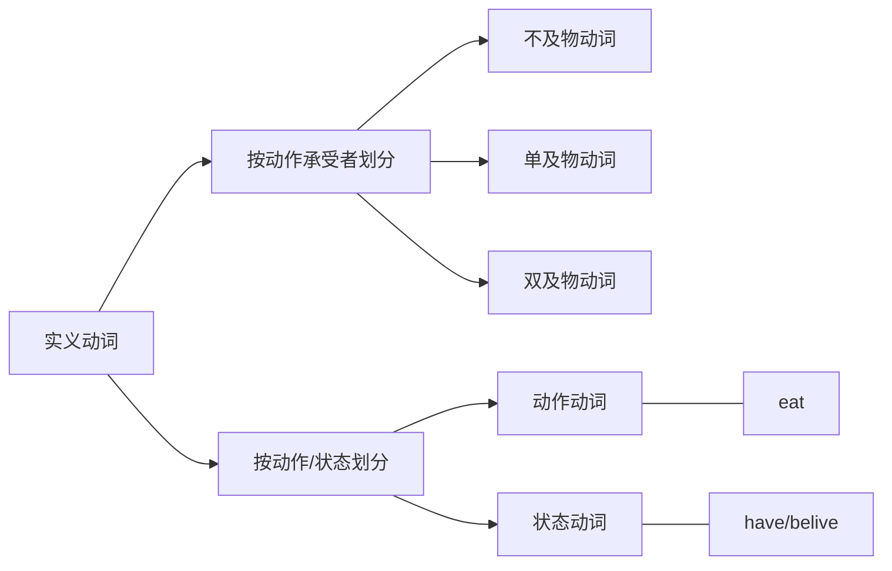

# 英语兔语法

## 语法综述

简单句：谁 + 干什么

- 主语+谓语（不及物动词）：The rabbit sleeps.
- 主语+谓语（单及物动词）+宾语：The rabbit likes you.
- 主语+谓语（双及物动词）+间接宾语+直接宾语： The rabbit teach you english.
- 主语+谓语（复杂及物动词）+宾语+宾补：The rabbit considers you smart.
- 主语+谓语（系动词）+表语/主语补语：The rabbit seems nice.

复合句/并列句：多个简单句，通过连词，连成一个句子

复杂句/从句：一个简单句作为另一个简单句的句子成分

- 名词性从句：主语从句、宾语从句、表语从句、同位语从句
- 定语从句：
- 状语从句：

句子成分：

- 主语：动作的发出者
- 谓语：动作
- 宾语：动作的承受者
- 宾补：与宾语存在主谓关系，即对宾语进行补充说明，在宾语和宾补之前加个is，能读通意思就是宾补，否则是直接宾语
- 表语/主语补语:
- 定语：
- 状语：
- 同位语：

词性：

- 名词：
- 动词：
- 形容词：
- 副词：
- 介词：
- 连词：
- 叹词：
- 数词：
- 冠词：
- 代词：

谓语动词：表达动作时间（现在、过去、将来、过去将来）、动作状态（一般、完成、进行、完成进行）、动作假设/情感。

非谓语动词：不定式、现在分词、过分分词、动名词。

## 动词

系动词可以被列入不及物动词或状态动词

实义动词和系动词可以做谓语动词

助动词、情态动词可以辅助构成谓语动词

### 系动词

系动词又称连系动词，即将系动词后面的性质赋予主语

I am a rabbit.

The rabbit is smart.

### 助动词

辅助主动词构成谓语动词，情态动词是助动车的一种

The rabbit ate a carrot. // 表过去，通过eat的过去式ate的变位来表达过去

The rabbit eats a carrot. // 表现在，动词原型表现在

The rabbit will eat a carrot. // 表将来，无法通过eat变为表将来，需要will来辅助

The bus leaves at 8.pm tonight. // 一般现在时表将来

The bus will leave at 8.pm tonight. // 一般将来时

> 基本助动词： be / do / have

The rabbit is eating a carrot. // is辅助构成现在进行时态

The rabbit dose likes coins. // dose 表强调

The rabbit has eaten a carrot. // has辅助构成现在完成时

> 情态助动词：

can/could

1. 表请求许可: Can/Could I borrow your book?  could比can更诚恳
2. 表可能性: Anything can/could happen.  could表对过去的推测
3. 有能力做/会/可以：I can kill a wolf.

may/might

1. 表请求许可： May/Might I borrow your book?   might比may更礼貌
2. 表可能性,但可能性小于can/could： The rabbit isn't here. He may at home.
3. 表祝愿，放句首：May you succeed! 祝你成功

> 半助词：

I will be able to reach the school if I leave right now. // be able to 表将来，was/were able to 成功做成某事

I'm going to eat dinner at 6.pm today. // be going to 表主观能动行，计划做某事

be about to // 马上就要做

You are to finish homework first. // be to 被命令做

I think they are to fall in love with each other. // 命中注定

You had better follow my order. // 最好做，忠告，警告之意

## 非谓语动词

- 谓语动词： 限制性动词，即受主语限制
- 非谓语动词：非限制性动词，即不受主语限制
- 非谓语动词可以充当除谓语外的所有句子成分，一定程度上简化了从句，使表达意思言简意赅

I like to eat carrots. // 不定式

I liked eating carrots. // 动名词，a carrot for eating

I'm a talking rabbit. // 现在分词

The rabbit likes minced carrots. // 过分分词

### 不定式

to + 动词原型

> 做主语：

To eat a carrot every day is good for the rabbit. // 只看to eat 不知道谁吃，也不知道过去还是将来吃，所以叫不定式

It is good for the rabbit to eat a carrot every day. // 可转it做形式主语

It is good that the rabbit eats a carrot every day. // 主语从句，it形式主语，后从句是真正主语

> 做宾语：

The rabbit likes to eat carrots.

> 做宾补：

The rabbit excepted the wolf to eat a carrot.

感官动词/使役动词 see/find/watch/have/make/let后面用不定式做宾补时，需省略to

You helped me (to) cook the carrot.

Carrots make rabbit feel happy.

> 做定语：

The rabbit has a lot of carrots to eat.

> 做状语（表达原因、目的、结果）：

I was surprised to get a thumbs-up. // 表原因

I was surprised beacause I got a thumbs-up. // 该写成原因状语从句

I will do anything to get a thumbs-up. // 表目的

I will do anything in order that I get a thumbs-up. // 该写成目的状语从句

I got enough thumbs-up to make annother video. // 表结果

I got enough thumbs-up, so that I made annother video. // 该写成结果状语从句

> 高级不定式：to + 动词原型的基础上增加表示状态

The rabbit seemed to be eating a carrot. // 兔子之前似乎正在吃一个胡萝卜

The rabbit will appear to have eaten a carrot. // 兔子之后会看起来好像已经吃了一个胡罗卜

### 动名词

本质相当于名词，动词原型+ing

> 做主语：

Eating carrot is healthy for rabbit.

> 做表语：

The rabbit's hobby is growing carrot.  // 眼见为实  Seeing is beliving.

> 做定语：

a sleeping pill  => a pill for sleeping

> 做宾语：The rabbit likes eating carrots.

以下动词后只能用动名词：enjoy/avoid/advise/consider/escape/mind/practice/insist on/give up/feel like/put off

The rabbit enjoys eating carrot.

与不定式做宾语的区别：

The rabbit stoped to eat a carrot. // 停下手里的活去吃一根胡罗卜，foget to do 忘记去做，未做

The rabbit stoped eating a carrot. // 停止吃一根， foget doing 忘记做过，已做

> 介宾=介词+宾语

The rabbit is fond of eating carrots. fond(adj), of eating(介宾)

The rabbit is looking forward to seeing the wolf again. // look forward 期待；盼望,  to seeing(介宾)

### 现在分词

基本相当形容词，不一定自带现在属性，也可充当副词

现在进行时 = be + 现在分词

> 与动名词的区分

a sleeping pill  => a pill for sleeping // 动名词用来说明药片的性质、作用、功能

a sleeping rabbit != a rabbit for sleeping // 现在分词相当于形容词，修饰兔子的状态

> 做副词：修饰紧跟着的形容词

We are having a ripping good time // ripping 相当于very

> 做定语:

a taking rabbit.

> 做表语：

The rabbit is charming. // 暗含主动关系，描述的是作出动作的人、物

The story is interesting.

> 做宾补：

The wolf saw the rabbit eating a carrot. // 现在分词做宾补，表示正在，强调动作状态

The wolf saw the rabbit eat a carrot. // 此处是不定式，to省略了，强调动作已经发生

> 做状语：

Hearing the news, the rabbit became excited. // 表时间

When he heard the news, the rabbit became excited. // 时间状语从句

Not knowing what to eat, the rabbit skiped lunch. // 表原因

Because he didn't what to eat, the rabbit skiped lunch. // 原因状语从句

### 过去分词

不带时间含义，不表示过去时间，动词原型+ed，但也有很多不规则变化

单独一个过去分词相当于形容词，an excited rabbit.

过去分词短语做定语，在放置在被修饰名词的后面，即后置定语，The carrot cake eaten by the rabbit is delicious.

> 做表语：暗含被动关系，被描述的是动作的接受者

The rabbit is interested in growing carrots.

> 做宾补：

The rabbit found his carrots stolen.

> 做状语：

Seen from the hill, the carrot field looks beautiful. //表地点，the carrot field(胡罗卜田是主语)，与seen是被动的关系，被看

Born in the rabbit family, the rabbit's only work is growing carrot. //表原因

> 与现在分词的区别，主语与动词之间是被动还是主动关系，过去分词表被动，现在分词表主动

The work finished, the rabbit went home. // 工作完成了，兔子才回家

The weather permitting, the rabbit will go out.
