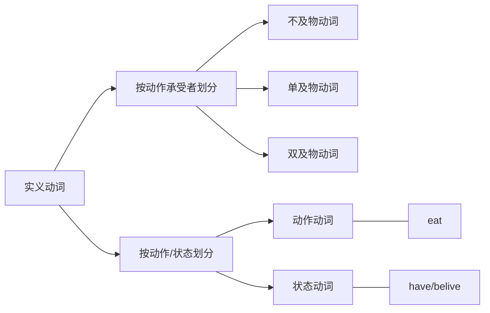
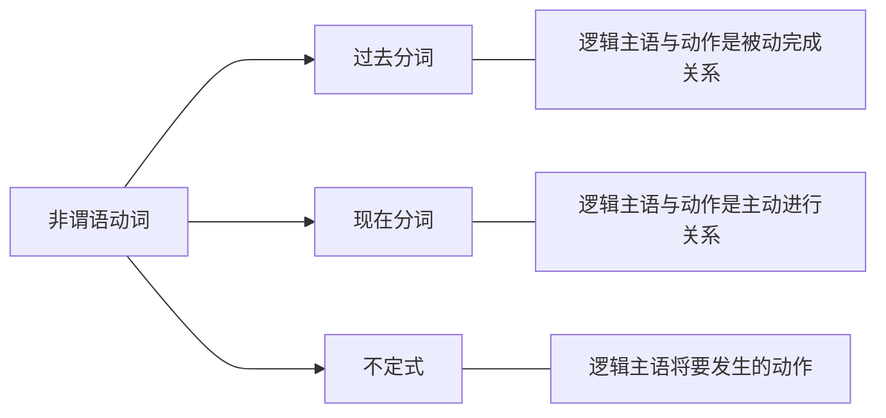

# 英语兔语法

官网：<https://www.yingyutu.com/>

## 语法综述

简单句：谁 + 干什么

- 主语+谓语（不及物动词）：The rabbit sleeps.
- 主语+谓语（单及物动词）+宾语：The rabbit likes you.
- 主语+谓语（双及物动词）+间接宾语+直接宾语： The rabbit teach you english.
- 主语+谓语（复杂及物动词）+宾语+宾补：The rabbit considers you smart.
- 主语+谓语（系动词）+表语/主语补语：The rabbit seems nice.

复合句/并列句：多个简单句，通过连词，连成一个句子

复杂句/从句：一个简单句作为另一个简单句的句子成分

- 名词性从句：主语从句、宾语从句、表语从句、同位语从句
- 定语从句：形容词从句、关系从句
- 状语从句：

句子成分：

- 主语：动作的发出者
- 谓语：动作
- 宾语：动作的承受者
- 宾补：与宾语存在主谓关系，即对宾语进行补充说明，在宾语和宾补之前加个is，能读通意思就是宾补，否则是直接宾语
- 表语/主语补语:
- 定语：
- 状语：
- 同位语：

词性：

- 名词：n.
- 动词：v.
- 形容词：a./adj.
- 副词：adv.
- 介词：
- 连词：conj.
- 叹词：
- 数词：
- 冠词：
- 代词：pron.

谓语动词：表达动作时间（现在、过去、将来、过去将来）、动作状态（一般、完成、进行、完成进行）、动作假设/情感。

非谓语动词：不定式、现在分词、过分分词、动名词。

## 动词

### 分类

系动词可以被列入不及物动词或状态动词

### 谓语动词

实义动词和系动词可以单独做谓语动词。助动词、情态动词不能单独做谓语动词，是用来辅助主动词构成谓语动词

动词原形，无“时”无“态”。非谓语动词，无“时”有“态”。谓语动词，有“时”有“态”

动词时态： 动词原型、动词现在式（即根据主语是否是第三人称单数+s/es/sh）、动词过去式（一般+ed）、现在分词（一般+ing）、过去分词（一般+ed）

过去式 vs 过去分词:

- 过去式表示主动、过去，有时间内涵，通常用作谓语，是一个完整独立的时态。用于一般过去时态中，表示过去发生的事情，表示短暂的动作。
- 过去分词表示被动或者完成，没有时间内涵，属于非谓语，相当于形容词或副词，不是一个完整独立的时态。表示完成，一般表示持续性的动作。

### 系动词

系动词又称连系动词，即将系动词后面的性质赋予主语

- I am a rabbit.
- The rabbit is smart.

### 助动词

辅助主动词构成谓语动词，情态动词是助动车的一种

- The rabbit ate a carrot. // 表过去，通过eat的过去式ate的变位来表达过去
- The rabbit eats a carrot. // 表现在，动词原型表现在
- The rabbit will eat a carrot. // 表将来，无法通过eat变为表将来，需要will来辅助
- The bus leaves at 8.pm tonight. // 一般现在时表将来
- The bus will leave at 8.pm tonight. // 一般将来时

> 基本助动词： be / do / have

- The rabbit is eating a carrot. // is辅助构成现在进行时态
- The rabbit dose likes coins. // dose 表强调
-The rabbit has eaten a carrot. // has辅助构成现在完成时

> 情态助动词：

can/could

1. 表请求许可: Can/Could I borrow your book?  could比can更诚恳
2. 表可能性: Anything can/could happen.  could表对过去的推测
3. 有能力做/会/可以：I can kill a wolf.

may/might

1. 表请求许可： May/Might I borrow your book?   might比may更礼貌
2. 表可能性,但可能性小于can/could： The rabbit isn't here. He may at home.
3. 表祝愿，放句首：May you succeed! 祝你成功

> 半助词：

I will be able to reach the school if I leave right now. // be able to 表将来，was/were able to 成功做成某事

I'm going to eat dinner at 6.pm today. // be going to 表主观能动行，计划做某事

be about to // 马上就要做

You are to finish homework first. // be to 被命令做

I think they are to fall in love with each other. // 命中注定

You had better follow my order. // 最好做，忠告，警告之意

### 使役动词

表达使、让、令的含义的动词

后接宾语+宾补，宾补可以是动词原型(或叫裸不定式)、形容词、副词、过去分词。。。

常用使役动词：

- make: 迫使xx做xx
- let: 允许xx做xx
- have: 给xx责任/任务
- get: 说服/鼓励xx做xx

## 时态

动作时间（现在、过去、将来、过去将来）和 动作状态（一般、完成、进行、完成进行）组合共16种

### 现在

> 一般现在时: S + V-s/es/sh

1. 表达事实
2. 表达习惯、重复的动作
3. 表达预计 发⽣的事: The bus leaves at 8.pm tonight.

> 现在进行时：be + V-ing(现在分词)

1. 表达某事在说话时正在 进⾏ 。
2. 表达某些事在将来要发⽣ 。 We are going to Paris next week.

> 现在完成时：have/has + V-ed(过去分词)

1. 表达⼀件事情已经完成

> 现在完成进行时：have/has been V-ing(现在分词)

1. 表达⼀件事在某⼀时间内发⽣了但还未结束

### 过去

> 一般过去时：S + V-ed(过去式)

表达⼀件事在过去某时刻已完成

> 过去进行时：was/were + V-ing(现在分词)

辨析：现在完成时(对现在有影响，I have gone to Shanghai,去了未回) vs 一般过去时（对现在没影响，I went to Shanghai,去了已回）

> 过去完成时：had + V-ed(过去分词)

表达过去某一时间点的过去对该点的影响.  He was tired because he hadn't sleep well.

> 过去完成进行时：had + been + V-ing(现在分词)

对于过去某个时间点,不但已经完成⼀部分,⽽且还在过去那点之后，继续进行一段时间

### 将来

> 一般将来时： will + V（动词原型）

表达将来某个时间点发⽣的动作 (说话者 ⼗分确定的 事)

> 将来进行时： will + be + V-ing(现在分词)

表达在将来某个时间,某个动作是在进⾏的过程中。(特别笃定某事⼀定发⽣）

> 将来完成时： will + have + V-ed(过去分词)

表达将来某⼀点A的过去某点B（点B可能是现在的过去，也可能是现在和点A之间），对将来点A的影响（表达特别特别确定的事）

The rabbit will have eaten a carrot tomorrow.

> 将来完成进行时： will + have + been + V-ing

表达对于将来某个点,不但已经完成了⼀部分,⽽且还要继续进⾏的动作。

You will have been watching my video. // 将来某⼀时间后, 看了,还要继续看⼀段时间

### 过去将来

> 一般过去将来时：would + V  /   was/were going to （would是will的过去式）

表示过去的将来

I said I would eat a carrot for lunch. // 我过去说，我会在过去的将来吃胡罗卜

I knew you would watch my video.

> 过去将来进行时： would + be + V-ing(现在分词)

I said I would be eating a carrot at 1pm tomorrow. // 我过去说，我明天下午1点将会正在吃胡罗卜

> 过去将来完成时：would + have + V-ed(过去分词)

I said I would have eaten a carrot by 1pm tomorrow. //我过去说，我到明天下午1点已经吃了一个胡罗卜

> 过去将来完成进行时：would + have + been + V-ing(现在分词)

I said I would have been eating lunch for 2 hours by 1pm tomorrow. //我过去说，我明天下午1点正在吃中饭，之前已经吃了2小时，后面还会继续吃。

## 虚拟语气

时态后退原则

### 表示不可能假设

描述脑中的想象，或与现实相反的，的主观意愿

> 与现在事实相反：条件句 过去式，主句 would+动词原型

If I knew it, I would tell you.

If I saw the rabbit now, I would bite him. // 虽有now，但虚拟语气与时间无关系，只要求谓语动词变化正确

> 与将来事实相反：条件句 should+动词原型，主句 would+动词原型，表真的不可能或可能性很小

If I should see the rabbit tomorrow, I would bite hime.

If should meet thee after long years, how should I great thee.
// 万一我们将来重逢，我该如何面对你呢（暗示咱俩相会，遥遥无期）

> 与过去事实相反: 条件句 had+过去分词，主句 would have+过去分词，假设对过去某一点有影响

If I had watched this videos before, I would have aced my test.

If I had seen the rabbit a few days ago, I would have bitten him.

### 表达愿望、请求、建议、命令等

希望某个动作/行为发生

> 对现在的希望： wish + 动词过去式

I wish I were a rabbit.

I wish You were here

> 对过去的希望：wish + had/would have + 动词过去分词

I wish I had eaten the carrots.

> 对将来的希望：wish + should/would/could/might + 动词原型

I wish I would eat the carrots.

demand suggest insist order ...+ (should) + 动词原型

It is high time that you ate a carrots. // ate虚拟语气，定语从句

> wish = would rather

I would rather that you didn't eat the carrots. // 现在希望，还没吃

I would rather that you hadn't eaten the carrots. // 对过去希望，已经吃了

## 非谓语动词

- 谓语动词： 限制性动词，即受主语限制
- 非谓语动词：非限制性动词，即不受主语限制
- 非谓语动词可以充当除谓语外的所有句子成分，一定程度上简化了从句，使表达意思言简意赅

I like to eat carrots. // 不定式

I liked eating carrots. // 动名词，a carrot for eating

I'm a talking rabbit. // 现在分词

The rabbit likes minced carrots. // 过分分词

### 不定式

to + 动词原型

> 做主语：

To eat a carrot every day is good for the rabbit. // 只看to eat 不知道谁吃，也不知道过去还是将来吃，所以叫不定式

It is good for the rabbit to eat a carrot every day. // 可转it做形式主语

It is good that the rabbit eats a carrot every day. // 主语从句，it形式主语，后从句是真正主语

> 做宾语：

The rabbit likes to eat carrots.

> 做宾补：

The rabbit excepted the wolf to eat a carrot.

感官动词/使役动词 see/find/watch/have/make/let后面用不定式做宾补时，需省略to

You helped me (to) cook the carrot.

Carrots make rabbit feel happy.

> 做定语：

The rabbit has a lot of carrots to eat.

> 做状语（表达原因、目的、结果）：

I was surprised to get a thumbs-up. // 表原因

I was surprised beacause I got a thumbs-up. // 该写成原因状语从句

I will do anything to get a thumbs-up. // 表目的

I will do anything in order that I get a thumbs-up. // 该写成目的状语从句

I got enough thumbs-up to make annother video. // 表结果

I got enough thumbs-up, so that I made annother video. // 该写成结果状语从句

> 高级不定式：to + 动词原型的基础上增加表示状态

The rabbit seemed to be eating a carrot. // 兔子之前似乎正在吃一个胡萝卜

The rabbit will appear to have eaten a carrot. // 兔子之后会看起来好像已经吃了一个胡罗卜

### 动名词

本质相当于名词，动词原型+ing

> 做主语：

Eating carrot is healthy for rabbit.

> 做表语：

The rabbit's hobby is growing carrot.  // 眼见为实  Seeing is beliving.

> 做定语：

a sleeping pill  => a pill for sleeping

> 做宾语：The rabbit likes eating carrots.

以下动词后只能用动名词：enjoy/avoid/advise/consider/escape/mind/practice/insist on/give up/feel like/put off

The rabbit enjoys eating carrot.

与不定式做宾语的区别：

The rabbit stoped to eat a carrot. // 停下手里的活去吃一根胡罗卜，foget to do 忘记去做，未做

The rabbit stoped eating a carrot. // 停止吃一根， foget doing 忘记做过，已做

> 介宾=介词+宾语

The rabbit is fond of eating carrots. fond(adj), of eating(介宾)

The rabbit is looking forward to seeing the wolf again. // look forward 期待；盼望,  to seeing(介宾)

### 现在分词

基本相当形容词，不一定自带现在属性，也可充当副词

现在进行时 = be + 现在分词

> 与动名词的区分

a sleeping pill  => a pill for sleeping // 动名词用来说明药片的性质、作用、功能

a sleeping rabbit != a rabbit for sleeping // 现在分词相当于形容词，修饰兔子的状态

> 做副词：修饰紧跟着的形容词

We are having a ripping good time // ripping 相当于very

> 做定语:

a taking rabbit.

> 做表语：

The rabbit is charming. // 暗含主动关系，描述的是作出动作的人、物

The story is interesting.

> 做宾补：

The wolf saw the rabbit eating a carrot. // 现在分词做宾补，表示正在，强调动作状态

The wolf saw the rabbit eat a carrot. // 此处是不定式，to省略了，强调动作已经发生

> 做状语：

Hearing the news, the rabbit became excited. // 表时间

When he heard the news, the rabbit became excited. // 时间状语从句

Not knowing what to eat, the rabbit skiped lunch. // 表原因

Because he didn't what to eat, the rabbit skiped lunch. // 原因状语从句

### 过去分词

不带时间含义，不表示过去时间，动词原型+ed，但也有很多不规则变化

单独一个过去分词相当于形容词，an excited rabbit.

过去分词短语做定语，在放置在被修饰名词的后面，即后置定语，The carrot cake eaten by the rabbit is delicious.

> 做表语：暗含被动关系，被描述的是动作的接受者

The rabbit is interested in growing carrots.

> 做宾补：

The rabbit found his carrots stolen.

> 做状语：

Seen from the hill, the carrot field looks beautiful. //表地点，the carrot field(胡罗卜田是主语)，与seen是被动的关系，被看

Born in the rabbit family, the rabbit's only work is growing carrot. //表原因

> 与现在分词的区别，主语与动词之间是被动还是主动关系，过去分词表被动，现在分词表主动

The work finished, the rabbit went home. // 工作完成了，兔子才回家

The weather permitting, the rabbit will go out.

## 独立主格

逻辑主语与真正主语不一致，相对“独立”

Because the wolf invited him, the rabbit decided to go to the party. // 不是独立主格，invited是相对于真正主语rabbit来变位的，用过去分词表被动，即被邀请

The wolf inviting him, the rabbit decided to go to the party. //是独立主格，inviting相对逻辑主语 wolf 来变位，用现在分词表主动，即主动邀请

### 对从句的简化

If the weather permits, the rabbit will go out. // 条件状语从句

The weather permitting, the rabbit will go out. // 简化

After the work was finished, the rabbit went home. // 时间状语从句

The work finished, the rabbit went home. // 简化

The rabbit is lying in the bed and a carrot is still held in his hand. // 要加is

The rabbit is lying in the bed, a carrot held in his hand. // 不要is

名词/代词 + 不定式: The rabbit to come, the wolf is overjoyed. // 表将要发生的动作

名词/代词 + 名词: Many animals went to the parth, some of them rabbits and wolves. // some 代词，rabbit and wolves 名词

名词/代词 + 形容词: Many animals went to the parth, some of them happy.

名词/代词 + 副词: The rabbit sat on the chair, head down. // 头垂着睡着了，head名词，down副词

名词/代词 + 介词短语: The rabbit came in, carrot in hand.

> 综上，这些句子更像是包含be的独立主格，即名词/代词 + be的现在分词（being）,然后省略being

Many animals went to the parth, some of them (being) rabbits and wolves. // some 代词，rabbit and wolves 名词

Many animals went to the parth, some of them (being) happy.

The rabbit sat on the chair, head (being) down. // 头垂着睡着了，head名词，down副词

The rabbit came in, carrot (being) in hand.

### 独立主格结构

with + 宾语 + 宾补

The work finished, the rabbit went to home.

With work finished, the rabbit went to hoem. // with可省略

The rabbit came in, with a carrot in his hand.

The rabbit came in, carrot in his hand.

## 从句

### 定语从句：形容词性从句、关系从句

The rabbit is eating a carrot(先行词) that(关系词) I bought.

- 关系代词：that/who/whom/whose/which
- 关系副词：where/why/when

| 陈述句      | 替换关系代词 | 关系代词提句首 |
| ----------- | ----------- | -------------|
| I bought a carrot      | I bought that| that I bought|
| The rabbit ate a carrot   | who ate a carrot  |  who ate a carrot |
| I saw the teacher yesterday | I saw whom yesterday | whom I saw  yesterday |
|The teacher's favorite food is carrot | whose favorite food is carrot| whose favorite food is carrot|
|The teacher likes the food| The teacher likes which| which the teacher likes which|

> that vs which

- 先行词是唯一的用that: The rabbit ate the carrot that I have ever seen. // all/the only/the first等
- 先行词是多选一用which:  The rabbit is eating a carrot which/that I bought.

关系副词可以转化为关系代词，即where/why/when =  at which / for which (介词+which)

- 限制性形容词性从句：The rabbit ate the carrots which was on the table. // 限定carrot的范围，桌子上的那一根，本来有很多根
- 非限制性形容词性从句：可做插入语解释说明，也可代指整句话
- The rabbit ate the carrots, which was on the table. // 只有一根胡罗卜，恰巧在桌子上
- The biggest carrot, which the rabbit ate, was on the table. // 最大的胡罗卜在桌子上，兔子吃了它
- My head, which is big, is useful when it rains. // 我有大头，下雨不愁

### 名词性从句

> 主语从句：句子主语有从句充当，要以引导词开头, where/when/who/what/that/whether/how

The fact is obvious. ==> That the rabbit ate a carrot is obvious. // that是从属连词

|主语从句|含义|
|--|--|
|That the rabbit ate a carrot is obvious.| 兔子吃了胡罗卜 |
|Whether the rabbit ate a carrot is obvious.| 是否吃，连接副词 |
|Where the rabbit ate a carrot is obvious.|  在哪吃，连接副词 |
|When the rabbit ate a carrot is obvious.| 啥时候吃，连接副词 |
|How the rabbit ate a carrot is obvious.| 怎样吃，连接副词 |
|Who ate a carrot is obvious.| 谁吃胡罗卜是明显的，连接代词 |
|What the rabbit ate is obvious.| 兔子吃什么是明显的，连接代词 |

以上都可以转成it做形式主语，如whether：It is obvious whether the rabbit ate a carrot.

- It is suggested that you (should) eat a carrot. // 虚拟语气
- That you (should) eat a carrot is suggested. // 转主语从句

> 宾语从句：在复杂句中做宾语，包含确定信息和不确定信息

- I saw that the rabbit ate a carrot. // 确定信息
- I saw whether the rabbit ate the carrot. // 以下是不确定信息
- I saw who ate the carrot.
- I saw what the rabbit ate.
- I saw where the rabbit ate a carrot.
- I saw when the rabbit ate a carrot.
- I saw how the rabbit ate a carrot.

that做引导词时一般可省略，但有例外

- I know (that) the rabbit eat a carrot. // 可省
- I didn't know that the rabbit eat a carrot and that you saw it. // 不能省，省会导致句子意思错误

某些词后的宾语从句的否定

- I think that the rabbit is smart. // 肯定句
- I don't think that the rabbit is smart. // 正确否定句
- I think that the rabbit isn't smart. // 错误否定句

主从时态一致

- I don't think you are right.
- I didn't think you were right. // 过去时
- I knew the rabbit liked carrots.
- I knew the sun rises in the east. // 不变的客观事实是例外

be + adj + that + 宾语从句：adj表达某种看法判断

- I am sure that there's a carrot on the table.
- I am happy that there's a carrot on the table.
- I am afraid that there's no carrot on the table.

> 表语从句：用一个从句做表语

- That the rabbit ate a carrot is secret. // 主语从句，两者强调的信息不一样
- The secret is that the rabbit ate a carrot. // 表语从句

> 同位语从句：可解释主语，也可解释宾语

- My teacher, Papa rabbit, likes carrots. // 同位语
- The fact that the rabbit eats a carrot did not surprise me. // 同位语从句，包含已知信息
- The question whether the rabbit will eat the carrot is on all our mind. // 同位语从句，包含未知信息
- I have no idea who ate the carrot. // idea是宾语，被从句修饰

> 宾补从句

- You can call me Papa Rabbit. // 名词做宾补语
- You can call me what you like. // 宾补从句
- My education made me who I am today. // 宾补从句

### 状语从句(副词性从句)

> 时间状语从句

在某一时间点之前，before

- The rabbit ate a carrot at home before the wolf stopped by. // 狼来串门之前
- Before the wolf stopped by, the rabbit ate a carrot at home. // 注意逗号断句

在某一时间点中/当时，when/while/as

- The rabbit was eating a carrot when I reached home. // when 时间点，突然
- The rabbit was eating a carrot while I was making  a video. // while 时间段
- I ate a carrot as I made a video. // as 同时

在某一时间点之后，after

- The rabbit ate a carrot after the wolf stopped by.

从某一时间点开始算，since，暗示对之后有影响

- The rabbit has shared 3 carrots since the wolf stopped by. // 自狼来串门，兔子已经分享了3个红萝卜
- The rabbit has not shopped sharing carrots since the wolf stopped by. // 自狼来串门,兔子一直在分享红萝卜

知道之后的某一时间点, until

- The rabbit waited unitl the wolf stopped by. // 兔子一直在等，直到狼来串门

一...就..., as soon as

- The rabbit will eat a carrot as soon as the wolf leaves.

下次...，the next time

- The rabbit will share the biggest carrot the next time the wolf stops by.

> 地点状语从句

- The rabbit ate a carrot where he found it. // 地点状语从句 = 地点
- The rabbit ate a carrot at the place where he found it. // 定语从句，修饰place

where强调形式：whereve/everywhere/anywhere

- The rabbit will go where he can find a rabbit.
- The rabbit will go whereve he can find a rabbit. // 强调不管哪里

> 比较状语从句

更。。。

- He is smarter than me.
- He is smarter than I am. // 副词状语从句

- The carrot is bigger than that one.
- The carrot is bigger than that one is. // 副词状语从句

- She is more beautiful than Snow White(白雪公主).
- She is more beautiful than Snow White is. // 副词状语从句

同样的。。。

- He is as smart as I am.
- This carrot is as big as that one is.
- She is as beautiful as Snow White is.

越。。。越。。。

- The more you practice English, the more fluent you become.
- The more coins you give me, the more videos I make.

> 条件状语从句

条件句总是比主句在时态上落后一个时间段，常用引导词if

- If the rabbit sees a carrot, he will eat it. // 主将从现，条件句是真实的假设，区别于虚拟语气的虚拟条件句
- The rabbit will eat the carrot if he sees it.

- If I saw a carrot, I would eat it. // 虚拟语气
- If I had seen a carrot, I would have eaten it.

其他引导词unless/provided/as long as/ in case

- Unless you like this videos, you will not give it a thumbs-up. // 除非你喜欢这个视频，否则你不会点赞
- Provided that my video is excellent, you will give it a thumbs-up. // 如果xx
- As long as I make excellent video, you will ramain my follower. // 只要xx
- In case you don't understand, please comment below. // 如果

> 让步状语从句

作出一个假设，进一步作出一个相反相对的假设

- Event if I see a carrot, I will not eat it. // 让步假设，即使我看见，实际没看见
- Althought/thought/Event thought I see a carrot, I will not eat it. // 让步事实，尽管我看见，实际看见了，

no matter/ regardless of + 疑问句

- No matter what happens, I will not eat the carrot. // 不管发生什么
- No matter Who order me, I will not eat the carrot. // 不管谁命令我
- No matter how hungry I am, I will not eat the carrot. // 不管我多么饿

> 方式状语从句

1.好像某事发生过的事实，2.好像某事正在发生的方式

- I feel good as if I just ate a carrot. // as if 好像，与现实相反的假设，实际没吃，主句是事实
- You spend so much money, as if you were a millionaire.

> 原因状语从句

because引导的从句放主句前后都可以，但Since/As一般只能放句首

- The rabbit ate a carrot, because he was hungry. // 因为，引出实在的因果关系
- Since you are hungry, you can eat the carrot. // 既然，引出大家都知道的情况
- As you were not here, we ate the carrot without you. // 因为，列出显而易见的事实

for也可以表原因，但for构成的是并列句

- You must really like me, for you have give a phone. // for前后两句子有同等地位，前者表推测，后者是推测的原因

> 目的状语从句

- In order that I could finish the video in time, I pulled an all-nighter. // 为了
- I pulled an all-nighter, so that I could finish the video in time. // so that 为了，不能放句首

目的状语从句一般使用情态动词can could may might should would,更能体现目的性

> 结果状语从句

- I ate a lot of carrots for lunch, so that I wasn't hungry at all at afternoon. // 结果状语从句 so that, 结果、导致
- I like the video, so I'll give it a thumbs-up // 并列句，so并列连词

- I ate so many carrots for lunch that I felt sick afterwork. // so...that
- It was such a tasty carrot that I ate it all at noce. // such + n. + that
- It was so tasty a carrot that I ate it all at noce. // so + adj. + that.

## 冠词

## 数词

## 代词

## 形容词

### 形容词做什么句子成分

> 做定语

前置定语顺序： 限定词（冠词、物主代词） + （主观）特征 + 尺寸+形状+新旧+颜色+来源+材料+用途

- a hungry rabbit // 前置定语
- a beautiful big round new block Chinese wooden table.
- somebody nice // 后置定语，某个好人
- anybody absent // 不在场的人
- everything possible // 所有可能的事
- nothing worth // 没有不对的事

形容词短语做定语

- carrots good for rabbits.
- the rabbit eager to eat carrots. // 形容词短语做定语
- the rabbit that is eager to eat carrots. // 定语从句
- the rabbit busy eating carrots. // 形容词短语做定语
- the rabbit that is busy eating carrots. // 定语从句

> 做表语

- The rabbit is hungry.
- The rabbit is alive/asleep/alone. // 一般做表语，不做定语
- a living/sleeping/lonely rabbit.
- The rabbit is ill/well = a sick/healthy rabbit.

> 做补语

- Carrots make rabbits happy.

> 做状语

- The rabbit came home, tired and hungry.

### 形容词的比较级和最高级

> 构成

todo

> 用法

## 副词

### 修饰谁

> 修饰动词

- This is a fast rabbit. // fast即是adj又是adv,此处做adj修饰名词rabbit.
- The rabbit runs fast. // fast做adv修饰动词run

> 修饰形容词、副词

- This is a very fast rabbit. // very即是adj又是adv, 此处做adv修饰形容词fast
- The rabbit runs very fast. // very做副词修饰副词fast.
- The rabbit is very good.
- I'm doing very well.

> 修饰名词

- The rabbit here runs very fast. // here做副词修饰名词rabbit

> 修饰句子

- Obviously, the rabbit here runs very fast. // 显然。。。

### 副词做什么句子成分

> 做状语、定语

- This is a very fast rabbit. // very做状语
- Obviously, the rabbit here runs very fast. // Obviously、very fast做状语

> 做表语

- The wolf is abroad. // 狼在国外

> 做宾补

- Let me in/out. // me宾语，in/out宾补

### 副词种类

> 方式副词

- The rabbit runs fast. // 表方式，可位于句首、句尾、句中
- Suddenly, the driver turned left.
- The driver suddenly turned left.
- The dirver turned left suddenly.

> 程度副词

- The rabbit runs very fast.  // very表示快的程度，一般放被修饰词前
- The rabbit runs very fast.

> 地点副词

- The rabbit eats carrot indoors/outdoors/upstairs/outstairs. // 一般位于句尾
- Here You can relax and forget all the troubles. // 也可放句首表强调

> 时间副词

- The rabbit ate a carrot yesterday. // 一般放句尾
- The rabbit is eating a carrot now.
- The rabbit will eat a carrot later.
- The rabbit has alrealy eaten some carrots. // 也可放句中句首

> 频率副词

- The rabbit eats carrot every day.
- Sometimes, the rabbit eats carrot.
- The rabbit usually eat  carrot.
- The rabbit eats carrot three times one day.

> 疑问副词: What/when/why/how

- What does the rabbit eats carrot? // 兔子吃胡萝卜干什么？
- When does the rabbit eats carrot?
- Why does the rabbit eats carrot?
- How does the rabbit eats carrot?

> 连接副词

- How the rabbit eats carrot is intersting. // how引导主语从句
- I don't know where the rabbit eats carrots. // where引导的宾语从句
- That is why the rabbit eats carrots. // why 引导表语从句

> 关系副词

- This was the place where the rabbit ate carrots.
- This is the reason why  the rabbit ate carrots.
- This was the day when  the rabbit ate carrots for the first time.

> 句子副词

- Obviously, the rabbit here runs very fast. // 放句首，用逗号与主句隔开

## 连词

连接有着并列的、同等语法地位的单词、词组、句⼦

### 并列连词

> 并列关系、选择关系、转折关系、因果关系

### 从属连词

> 引导名词性从句、引导副词性（状语）从句

## 主谓一致

### 语法一致(单复数一致)

> 单复数主语

- Time is money. // time是不可数名词，做主语时看作单数
- Carrots are delicious.
- Carrots have been eaten. // carrots可数名词+have谓语动词复数
- Carrot juice has been sold. // 不可数名词+has谓语动词单数
- To eat a carrot everyday is good for rabbits. // 不定式做主语，看作单数
- Eating carrots is healthy. // 动名词做主语，看作单数
- The rabbit and wolf are at the party. // 用and连接的，看作复数，但有例外，见意义一致

> 假象主语（就远原则）

- The rabbit as well as anthor animals gets a carrot. // the rabbit 是主语，看作单数，as well as anthor animals是对主语的补充
- All the animals except the wolf get a carrot. // All the animals 是主语，看做复数， except the wolf是补充

> 不定代词做主语，与不定代词背后代表的含义一致

- Everyone gets a carrot. // 每一个，是单个，所以是单数
- Each of them gets a carrot. // 每一个
- Both of them like carrots. // 他们两个，复数
- Some of them are afraid of the wolf. // 一些，复数
- None of them get/gets carrots. // None没有，没法数，单复数均可
- Neither of them is/are afraid of the wolf. // Neither没法数

### 意义一致(主语含义)

> 同一主语多个身份

- The teacher and video creator is a rabbit. // 一个人，单数
- The teacher and the video creator are rabbits. // 两个人，复数

> 复数名词的单数含义，即形式上是复数，表达的意思确是单数

- Ten years is a long time. // 主语含义是十年这一个时间段
- Two coins isn't a lot. // 两个硬币这一份钱
- A knife and fork is needed for eating carrots. // 一副刀叉
- Bread and butter is also needed at dinner. // 此处用are也不算错

> 不定代词的单复数形式

- All is quiet. // All 指一切时，是单数，相当于everything
- All are quiet. // All 指所有人时，是复数

> 名词的形和意

- Physics is my favorite subject. // 形复意单
- The cattle are on the hill. // 牛群在山上
- A sheep is eating grass. // 单复数同形名词，还有deer/means/series/species
- The sheep are eating grass.

> 集合名词

- The rabbit's family is huge. // 指家庭，单数
- The rabbit's family are all at home. // 指家庭成员，复数
- All the furniture here is expensive. // 只能表示一个类别的事物，只能是单数
- The young are expected to learn from the old. // the+形容词，表示年轻人们，复数
- The new is going to replace the old. // 新事物，单数

### 就近一致(就近原则)

以下连接两个代词或名词做主语时，谓语动词的单复数由离代词或名词较近的决定

- or, either...or..., neither...nor..., not only...but also...
- Either you or I am going to the party.
- Not only the rabbit but also anthor annmals like carrots.

there be 句型

- There is a carrot and two apples on the table.
- There are two apples and a carrot on the table.

## 倒装

为强调某些信息，而颠倒原有语序

- 正常语序：主语+谓语
- 倒装语序：谓语+主语

### 完全倒装

谓语动词放主语前

> 副词或介词短语提前的倒装

- The last bus goes. // 正常语序
- There goes the last bus. // 地点副词here/there...提前倒装，强调开走了
- The wolf's turn comes now. // 正常语序
- Now comes the wolf's turn. // 时间副词now/then...提前倒装
- Carrots went up into the car. // 正常
- Up went carrots into the car. // 表示运动方向的词up/down/in/out/away提前
- The rabbit sat at the table. // 正常
- At the table sat the rabbit. // 介词短语提句首

> 主系表结构倒装：做表语的形容词、分词、介词短语、such提句首

- A group of rabbits is seated on the groud. // 正常
- Seated on the groud is a group of rabbits. // 倒装
- The wolf's trick were such. // 正常
- Such were the wolf's trick. // 倒装

### 部分倒装

分离仅助动词提前

> 句首有否定含义词的倒装

- I have never eaten such a delicious carrots. // 正常
- Never have I eaten such a delicious carrots. // 倒装

> 句首有only时的倒装

- We can only in this way grow carrots. // 正常
- Only in this way can we grow carrots. // 倒装
- Only then did the rabbit meet the wolf. // 倒装

> if...should...构成的虚拟语气的倒装

- If I should win the lottery, I would buy carrots. // 正常
- Should I win the lottery,  I would buy carrots. // 倒装

> 固定句形

- Rabbits love eating carrots. So do wolves. //  So do wolves 倒装
- I was afraid. So was I.(I'm afraid too) // 倒装
- The rabbit cann't ride the bicycle. Neither/No can the wolf. // 倒装

### 形式倒装

只把强调的内容提句首，谓语不提

> 感叹句倒装

- What a delicious carrot it is. // 倒装

> 比较句型

- If you eat more carrots, you will become healther. // 比较状语从句
- The more carrots you eat, the healther you become. // 倒装

> however/whatever引导让步状语从句的倒装

- However long this video is, you should watch it till the end.

> as/though 引导让步状语从句的倒装

- Mach as he likes the carrot, he doesn't want to eat it.

## 被动

强调动作的承受者

主谓、主系表无被动

> 主谓宾

- The rabbit ate the carrot.
- The carrot was eaten by the rabbit.

> 主谓宾宾

- The rabbit gives the carrot to the wolf.
- The carrot was given to the wolf by the rabbit. // 强调直接宾语carrot
- The wolf was given the carrot by the rabbit. // 强调间接宾语wolf

> 主谓宾宾补

- The wolf invited the rabbit to her party.
- The rabbit was invited to the party by the wolf. // 被动
- The rabbit made the wolf laugh. // 此处made实际是省略了to的不定式
- The wolf was made to laugh by the rabbit. // 变被动时要还原to

## 标点
